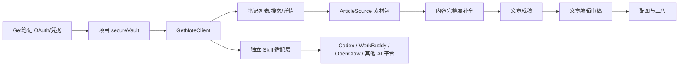

# Get笔记独立连接器与跨平台 Skill 规划

## 目标

把 Get笔记能力从当前开发环境中的 OpenClaw skill 依赖，升级为本项目内置、可独立部署、可迁移、可测试、可再次封装为跨 AI 工作平台 skill 的内容来源模块。

最终效果：

- 每个创作者都可以在本项目 Web 台完成 Get笔记授权。
- 项目直接调用 `https://openapi.biji.com`，不依赖 OpenClaw、ClawHub、Codex 本地 skill。
- 用户可以搜索、浏览、选择一篇或多篇 Get笔记，生成公众号文章工作流。
- Get笔记素材进入现有流程：内容完整度补全 -> 文章成稿 -> 编辑审稿 -> 配图 -> 归档 -> 上传草稿箱。
- 后续可以把同一套 Get笔记连接器封装成独立 skill，供 Codex、WorkBuddy、OpenClaw 或其他 AI 工作平台调用。

## 当前独立性验证

已完成一次项目级独立验证：

- 凭据来源：复制当前 Get笔记授权到本项目 `data/secure/secrets.enc.json`。
- 凭据保存：使用项目已有 `secureVault`，不写入 `publisher.config.json`，不提交 git。
- 验证方式：从项目密文库读取 `getnote.apiKey` 和 `getnote.clientId`，直接请求 Get笔记开放 API。
- 验证结果：`status: 200`，返回最近笔记 `20` 条，`usedOpenClaw: false`。

这说明后续独立部署不需要 OpenClaw 作为运行时依赖。

## 核心架构



## 模块拆分

### 1. 项目内置 Get笔记连接器

建议新增目录：

```text
src/connectors/getnote/
  client.js
  oauth.js
  normalizer.js
  errors.js
```

职责：

- `client.js`
  - `listNotes({ cursor })`
  - `searchNotes({ query, topK })`
  - `getNoteDetail({ noteId, imageQuality })`
  - `listKnowledgeBases()`
  - `searchKnowledge({ topicId, query, topK })`
  - 统一认证头、错误处理、限流处理、ID 字符串保护。

- `oauth.js`
  - `startDeviceAuthorization()`
  - `pollDeviceAuthorization({ code })`
  - `saveGetNoteCredentials({ apiKey, clientId, keyId, expiresAt })`
  - 不依赖 OpenClaw 配置文件。

- `normalizer.js`
  - 把 Get笔记 API 响应转成项目统一素材格式。
  - 音频笔记优先提取 `audio.transcript` / `audio.original`。
  - 链接笔记可提取 `web_page.content` / `web_page.excerpt`。
  - 图片笔记保留 Markdown 图片与附件信息。

- `errors.js`
  - 处理 `unauthorized`、`not_member`、`rate_limit`、`not_found`、系统错误。
  - 统一输出给 Web 和 CLI。

### 2. 项目统一文章来源

建议新增：

```text
src/core/articleSource.js
```

统一结构：

```js
{
  sourceType: "getnote",
  sourceIds: ["note_id_1", "note_id_2"],
  title: "素材包标题",
  rawText: "合并后的文章素材",
  metadata: {
    source: "getnote",
    noteIds: [],
    noteTitles: [],
    noteTypes: [],
    tags: [],
    topics: [],
    createdAt: "",
    updatedAt: ""
  }
}
```

这样 workflow 不需要知道素材来自 Get笔记、手动粘贴还是本地文件。

### 3. 密文保存与迁移

复用现有：

```text
data/secure/master.key
data/secure/secrets.enc.json
```

新增密文结构：

```json
{
  "getnote": {
    "apiKey": "gk_live_xxx",
    "clientId": "cli_xxx",
    "keyId": "xxx",
    "expiresAt": 1812252836
  }
}
```

状态接口只返回：

```json
{
  "hasGetNoteCredentials": true,
  "getNoteExpiresAt": 1812252836
}
```

不得返回 API Key。

迁移要求：

- 单机迁移：复制 `data/secure/` 即可。
- 多用户部署：每个用户单独一份 vault 或数据库加密记录。
- SaaS 部署：升级为数据库 + KMS/主密钥，不共用单个 `master.key`。

## Web 产品流程

### 二级菜单：内容来源

新增菜单：

```text
内容来源
  - Get笔记连接状态
  - 授权/重新授权
  - 最近笔记
  - 搜索笔记
  - 知识库筛选
```

### 从 Get笔记创建文章

用户流程：

1. 点击“从 Get笔记选素材”。
2. 搜索关键词或查看最近笔记。
3. 选择 1 篇或多篇笔记。
4. 预览素材包：标题、来源、标签、摘录、预计字数。
5. 点击“创建公众号文章工作流”。
6. 进入主流程：
   - 内容完整度补全
   - 文章成稿
   - 文章编辑审稿
   - 配图 Brief
   - 图片生成
   - 本地归档
   - 上传草稿箱

### 隐私默认策略

- 搜索结果默认只展示标题、类型、标签、更新时间、短摘录。
- 详情展开需要用户点击。
- 多笔记合并前显示来源列表。
- 上传草稿箱前显示本次使用了哪些 Get笔记来源。

## Web API 设计

建议新增接口：

```text
GET  /api/getnote/status
POST /api/getnote/oauth/start
POST /api/getnote/oauth/poll
GET  /api/getnote/notes?cursor=
POST /api/getnote/search
GET  /api/getnote/notes/:id
POST /api/getnote/source-pack
POST /api/workflows/create-from-getnote
```

接口说明：

- `/api/getnote/status`
  - 返回是否已授权、过期时间、是否接近过期。

- `/api/getnote/oauth/start`
  - 申请设备授权码。
  - 返回 `verification_uri`、`user_code`、`expires_in`、`interval`。

- `/api/getnote/oauth/poll`
  - 前端定时轮询。
  - 成功后写入 `secureVault`。

- `/api/getnote/notes`
  - 最近笔记列表。
  - 不默认返回全文。

- `/api/getnote/search`
  - 语义搜索。
  - 参数：`query`、`topK`。

- `/api/getnote/notes/:id`
  - 获取详情。
  - note_id 必须当字符串处理。

- `/api/getnote/source-pack`
  - 把多个 note_id 合并为文章素材包。

- `/api/workflows/create-from-getnote`
  - 直接从素材包创建现有 workflow。

## CLI 设计

建议新增：

```bash
wechat-draft getnote status
wechat-draft getnote auth
wechat-draft getnote list
wechat-draft getnote search "叙事疗法 外化"
wechat-draft getnote detail <note_id>
wechat-draft getnote create "叙事疗法 外化" --top-k 3
```

安全规则：

- `detail` 和 `create` 可以读取全文。
- `list` 和 `search` 默认只打印标题、类型和短摘录。
- 所有命令都从项目 `secureVault` 读凭据，不读 `~/.openclaw`。

## 独立性验收标准

### 运行时独立

必须满足：

- 卸载或禁用 OpenClaw 后，项目仍能执行 Get笔记列表、搜索、详情。
- 项目源码中不调用 `openclaw` CLI。
- 项目源码中不读取 `~/.openclaw/openclaw.json`。
- Get笔记凭据只来自项目 `secureVault` 或部署环境变量。

建议验证命令：

```bash
env -u OPENCLAW_STATE_DIR -u OPENCLAW_CONFIG_PATH npm test
node scripts/verify-getnote-independent.js
```

### 数据安全

必须满足：

- API Key 不出现在日志、Web 响应、归档文章 JSON。
- `data/secure/` 被 git ignore。
- Web 状态接口只返回 boolean 与过期时间。
- 文章归档只记录 `note_id`、标题、标签、来源，不记录 API Key。

### API 正确性

必须满足：

- int64 note_id 全程字符串化。
- 搜索接口 `top_k` 最大限制为 10。
- API 返回 `success:false` 必须显式报错。
- 429 按 `rate_limit.retry_after` 重试或提示。
- `not_member` 引导用户开通会员，不继续调用。

### 文章工作流正确性

必须满足：

- 从 Get笔记创建 workflow 后，`workflow.data.sourcePack` 保存来源。
- 内容完整度补全能看到笔记来源和素材缺口。
- 成稿不能编造笔记里没有的具体经历、数据、人物评价。
- 编辑审稿会检查文章是否忠实于 Get笔记素材。
- 草稿上传前显示来源追溯。

## 测试计划

### 单元测试

新增：

```text
tests/getnote-client.test.js
tests/getnote-oauth.test.js
tests/article-source.test.js
```

覆盖：

- 认证头构造。
- note_id 字符串保护。
- 搜索结果规范化。
- 详情结果规范化。
- 音频、链接、图片、纯文本笔记的正文提取。
- API 错误码处理。
- secureVault 读写 getnote 凭据。

### 集成测试

使用 mock server，不依赖真实 Get笔记：

- OAuth start/poll 成功。
- 搜索 -> 详情 -> sourcePack -> workflow。
- 多笔记合并后创建文章工作流。
- 未授权时 Web API 返回清晰错误。

### 真实连通性测试

单独脚本，不进入默认 `npm test`：

```bash
node scripts/verify-getnote-independent.js
```

验证：

- 从项目 secureVault 读取凭据。
- 请求 `/note/list`。
- 请求 `/recall`。
- 请求某个 note detail。
- 输出只包含数量、状态、request_id，不输出正文。

## 分阶段实施

### Phase 0：独立性证明

状态：已完成。

- Get笔记凭据已复制到项目 `secureVault`。
- 已直接调用 Get笔记 API，确认不依赖 OpenClaw。

### Phase 1：内置连接器

目标：

- 实现 `src/connectors/getnote/client.js`。
- 实现 `secureVault` 的 Get笔记状态。
- 增加单元测试。

验收：

- `npm test` 通过。
- `verify-getnote-independent` 通过。
- 源码不包含 `openclaw` 运行时调用。

### Phase 2：Web 与 CLI

目标：

- Web 增加授权、搜索、列表、详情。
- CLI 增加 `getnote` 子命令。

验收：

- 用户可在 Web 中授权并搜索笔记。
- 不展开全文也能选择素材。
- 选择笔记后能创建 workflow。

### Phase 3：文章来源工作流

目标：

- 实现 `ArticleSource` / `sourcePack`。
- 从 Get笔记一键创建公众号文章。
- workflow 保存来源追溯。

验收：

- 使用 1 篇笔记生成文章。
- 使用多篇笔记合并生成文章。
- 本地归档包含来源记录。
- 编辑审稿能识别是否偏离素材。

### Phase 4：独立 Skill 化

目标：

- 抽出 `skill/getnote-connector/SKILL.md`。
- 提供平台无关脚本：
  - `scripts/getnote_search.js`
  - `scripts/getnote_detail.js`
  - `scripts/getnote_source_pack.js`
  - `scripts/getnote_auth.js`
- Skill 不依赖本公众号项目即可执行基础 Get笔记操作。

验收：

- 在 Codex skills 目录安装后可搜索笔记。
- 在 WorkBuddy skills 目录安装后可搜索笔记。
- 在公众号项目中可复用同一套脚本。
- Skill 文档明确隐私、认证、ID 字符串和错误处理规则。

## 独立 Skill 设计

Skill 名称建议：

```text
getnote-source-connector
```

Skill 能力：

- 配置 Get笔记授权。
- 搜索笔记。
- 查看笔记详情。
- 把笔记转换成文章素材包。
- 给外部文章生成工具提供结构化输入。

Skill 输出标准：

```json
{
  "sourceType": "getnote",
  "sourceIds": [],
  "title": "",
  "rawText": "",
  "metadata": {
    "noteTitles": [],
    "noteTypes": [],
    "tags": [],
    "createdAt": "",
    "updatedAt": ""
  }
}
```

这样不同 AI 平台只要读这个 JSON，就能接入自己的写作、总结、问答或知识管理流程。

## 关键风险

- Get笔记 OAuth 是否允许多平台复用同一个预注册 client_id。
- API Key 一年有效，过期提醒必须清晰。
- 音频/课堂笔记可能非常长，需要摘要压缩或分段 sourcePack。
- 多用户部署时不能共享 vault。
- Web 展示全文要谨慎，避免隐私泄露。

## 最终定义完成

当以下全部满足时，认为 Get笔记独立化完成：

- 项目可在一台没有 OpenClaw 的机器上连接 Get笔记。
- 用户可通过 Web 授权、搜索、选择笔记。
- 选中笔记可创建公众号文章工作流。
- 文章归档保留来源追溯。
- `npm test` 和独立真实连通性验证均通过。
- `skill/getnote-connector` 可被复制到其他 AI 工作平台独立使用。
